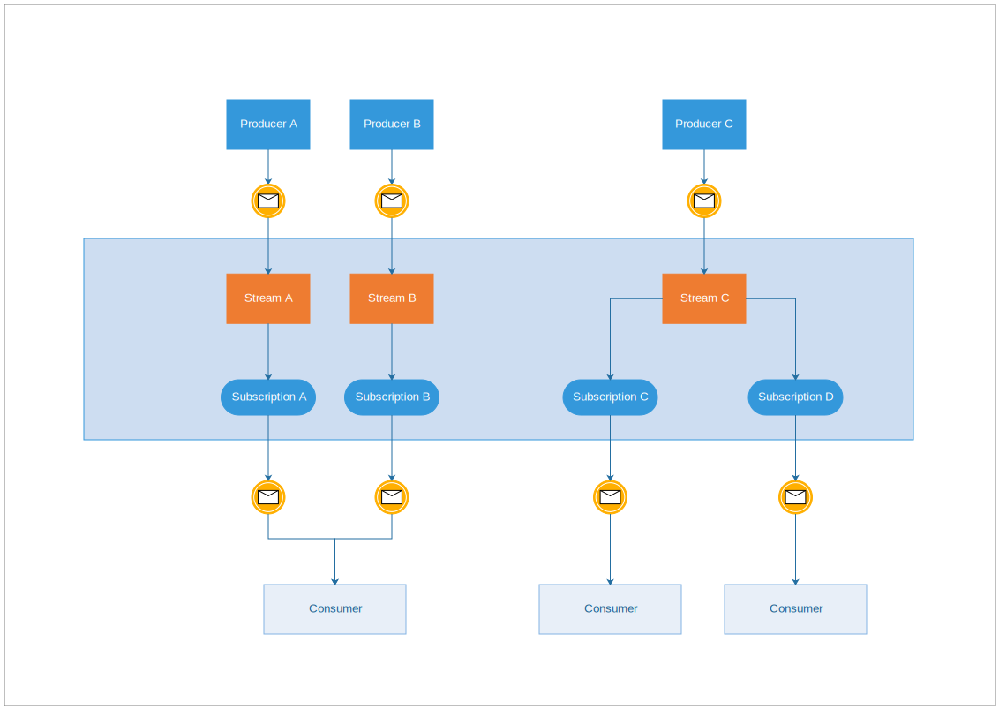

# ECHO Pub/Sub Framework

Echo is a Pub/Sub framework with asynchronous messaging service that decouples services that produce events from services that process events.

You can use ECHO as messaging-oriented middleware or event ingestion and delivery for streaming data pipelines. 

## Core concepts

  - **Stream** A named resource to which messages are sent by publishers.
  - **Producer** A named resource representing the stream of events (messages) from a single, specific topic, to be delivered to the subscribing application (consumers).
  - **Consumers** A named resource representing the application/entity subscribed to a stream to receive events.
  - **Event** The combination of data and (optional) attributes that a producer sends to a stream(topic) and is eventually delivered to consumers.

## Producer Consumer Relationship

A producer application creates and sends events to a stream. Consumer applications create a subscription to a event to receive messages from it. Communication can be one-to-many (fan-out), many-to-one (fan-in), and many-to-many.



## Common use cases

  - Balancing workloads in network clusters. For example, a large queue of tasks can be efficiently distributed among multiple workers.
  - Implementing asynchronous workflows. For example, an order processing application can place an order on a stream, from which it can be processed by one or more workers.
  - Distributing event notifications. For example, a service that accepts user signups can send notifications whenever a new user registers, and downstream services can subscribe to receive notifications of the event.
  - Refreshing distributed caches. For example, an application can publish invalidation events to update the IDs of objects that have changed.
  - Logging to multiple systems. For example, an application can write logs to the monitoring system, to a database for later querying, and so on.
  - Data streaming from various processes or devices. For example, a residential sensor can stream data to backend servers hosted in the cloud.
  - Reliability improvement. For example, a single-zone Compute  service can operate in additional zones by subscribing to a common topic, to recover from failures in a zone or region.


## Installation

1. Add the dependency to your `shard.yml`:

   ```yaml
   dependencies:
     echo:
       github: eliasjpr/echo
   ```

2. Run `shards install`

## Usage

Available streams backends 

- Redis Streams
- In memory

```crystal
require "echo"


struct World
  include Echo::Event
  getter name : String = ""

  def initialize(@name)
  end
end

struct Marco
  include Echo::Event
  getter name = "Marco"
end

class WorldProducer
  include Echo::Producer::Redis(World)
  include Echo::Producer::Redis(Marco)
  # Or 
  include Echo::Producer::Memory(World)
  include Echo::Producer::Memory(Marco)

  # subscribe and publish methods are now available
end

class WorldConsumer
  include Echo::Consumer(World)
  include Echo::Consumer(Marco)

  getter count : Int32 = 0

  def on(event : World | Marco)
    @count += 1
    ...do something...
  end
end
```


## Contributing

1. Fork it (<https://github.com/eliasjpr/echo/fork>)
2. Create your feature branch (`git checkout -b my-new-feature`)
3. Commit your changes (`git commit -am 'Add some feature'`)
4. Push to the branch (`git push origin my-new-feature`)
5. Create a new Pull Request

## Contributors

- [Elias J. Perez](https://github.com/eliasjpr) - creator and maintainer
